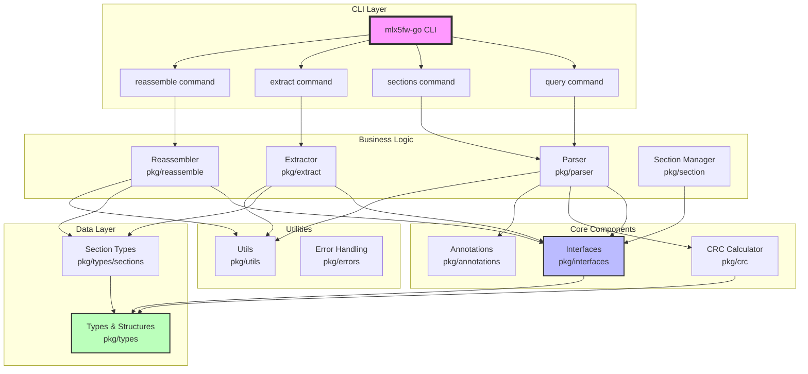
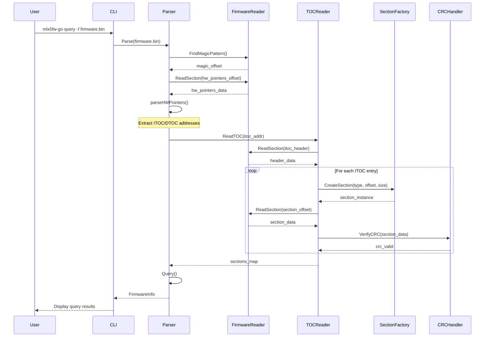
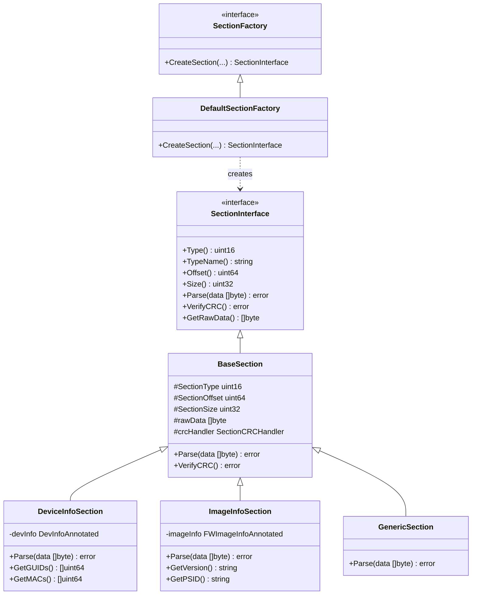
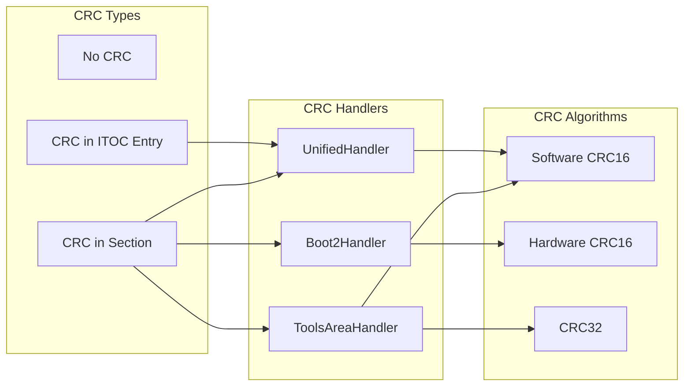
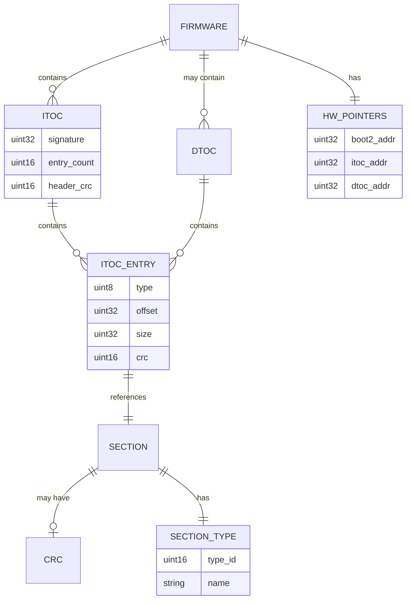
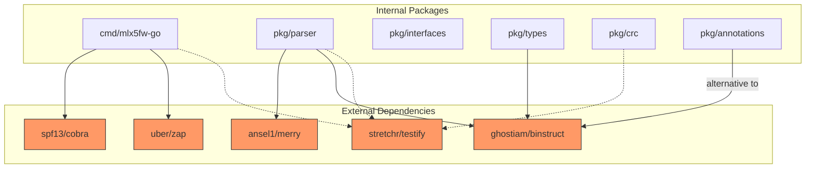
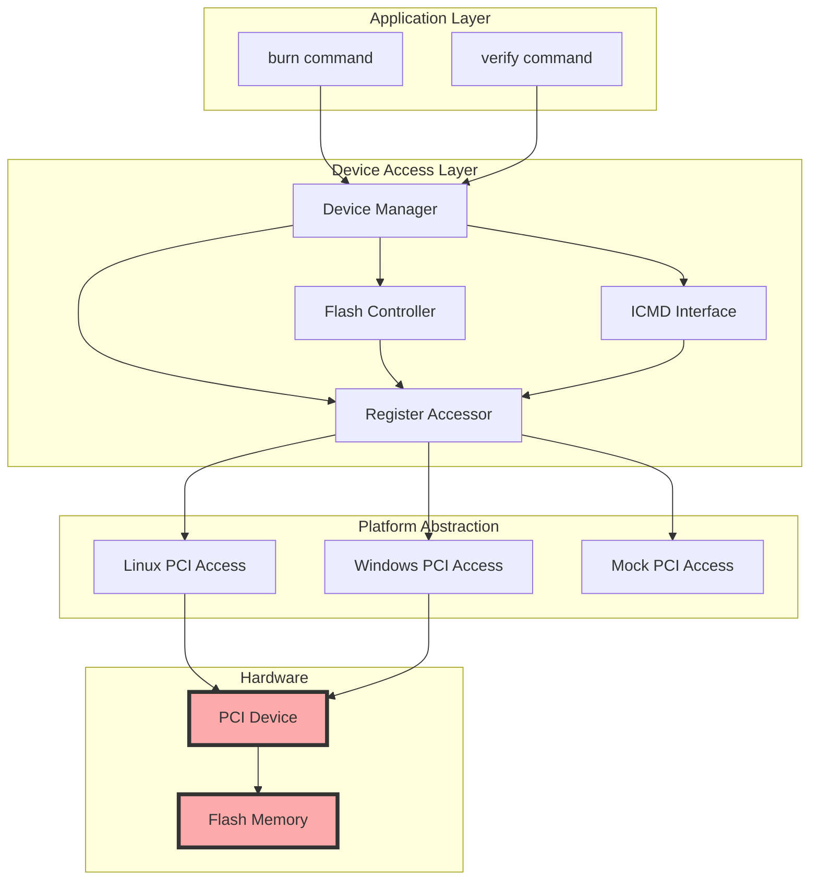

# Architecture Diagrams

## System Architecture Overview

## Firmware Parsing Flow

## Section Creation and Management

## CRC Verification Architecture

## Data Structure Relationships

## Component Dependencies

## Future Device Access Architecture

